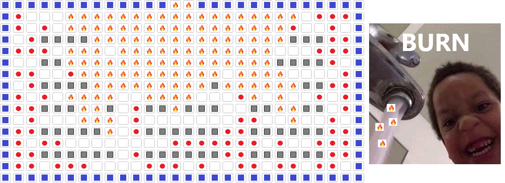

<h3 align="center">EmergencyEvacuationSimulator</h3>

	This tool has been created as a part of course 'Modelling and simulations'.
	 
	We were given a task to create a simulation based on cellular systems.
	 
	Simulation measures number of people in the simulation, number of people which died during the simulation and estimated time.

## Dependencies

 - GUI Framework Qt (voluntarily, you may use console version)

## About the tool

 - Tool may be used within the terminal using the `make` command
 - Tool has GUI, which allows us to control simulation, visualize simulation & see statistics using `make gui` command
 - Simulation can be adjusted using the command line arguments (e.g.: increase crowd-influence, increase fire spread, etc.). See help `-h`
 - See the doc/doc.pdf for more infos (czech) or documentation of the code (english)

## Examples

 - Running GUI version using the default arguments
 - Build target `make gui`
 - Run simulation `./evactuation`
 - In the GUI, you may add/remove exit by left/right clicking on the cell, same for adding/removing fire on the cell
 - Run the simulation using green button, stop simulation using red button, perform one step of the simulation using blue button
 - See statistics for results
 - More images in doc/doc.pdf & doc/experiments

 <b>Beginning of the simulation</b>: 

  <b>Progress of the simulation</b>: 

  <b>Simulation finished</b>: 

## Facts

 - People will try to get to the closest exit
 - People will run away from the fire
 - According to crowd-influence, people may run to the same direction as others
 - Random distribution of probability of the movement (people won't go straight to the exits)
 - It's just simulation and NOBODY gets hurt (so you may do whatever you want with people in simulation, eg. let'em all burn, or save'em all)

